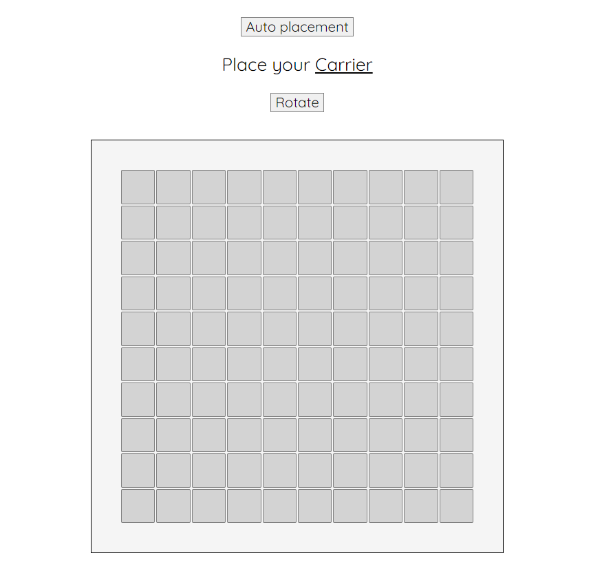
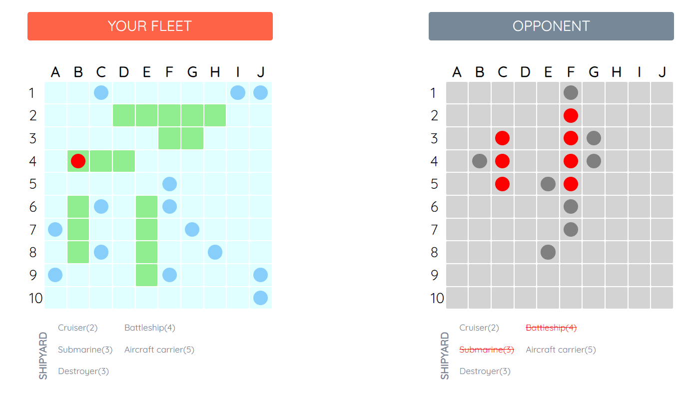

# Battleship
This project is based on the original game [battleship](https://en.wikipedia.org/wiki/Battleship_(game)). A simple online two person strategy game. This version is played between a single player and a random computer advesary.

Check out the live demo [here](https://edgarmuyomba.github.io/battleship/)

## Gameplay
A user is initially guided to place their attack ships on the board either manually or automatically. this can be done along both axis. The computer's ships are placed automatically as well.


The user and the opponent can then take turns clicking on each other's boards trying to figure out where the other's ships are in order to deliver an attack. 
Successfully hitting and sinking the opponents' ships results in a victory.


## Setting up dev
1. Clone the repository in your desired directory
    ```
    git clone https://github.com/edgarmuyomba/battleship.git
    ```
2. Enter the created folder `battleship` using the terminal
3. Install the required dependencies
   ```
   npm install
   ```
4. Run the demo and access it on [localhost:8080](http://localhost:8080/)
   ```
   npm start
   ```

## Built with
1. html, css, javascript
2. webpack